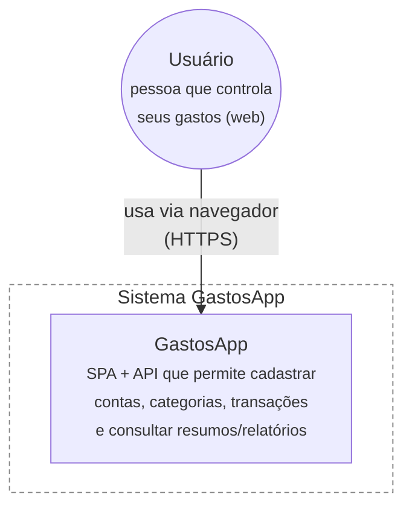
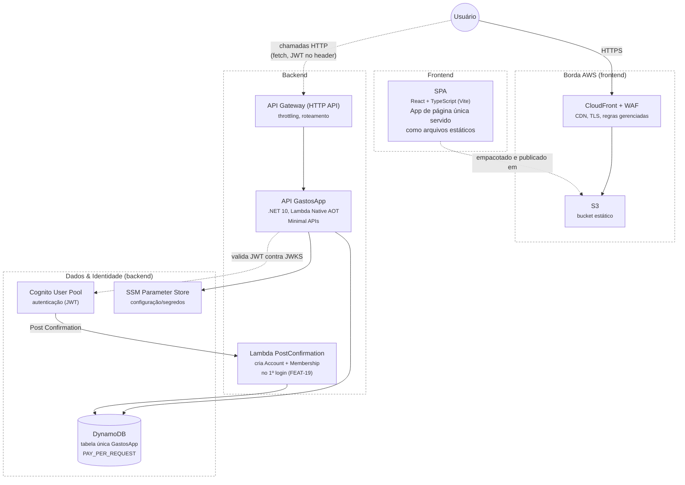
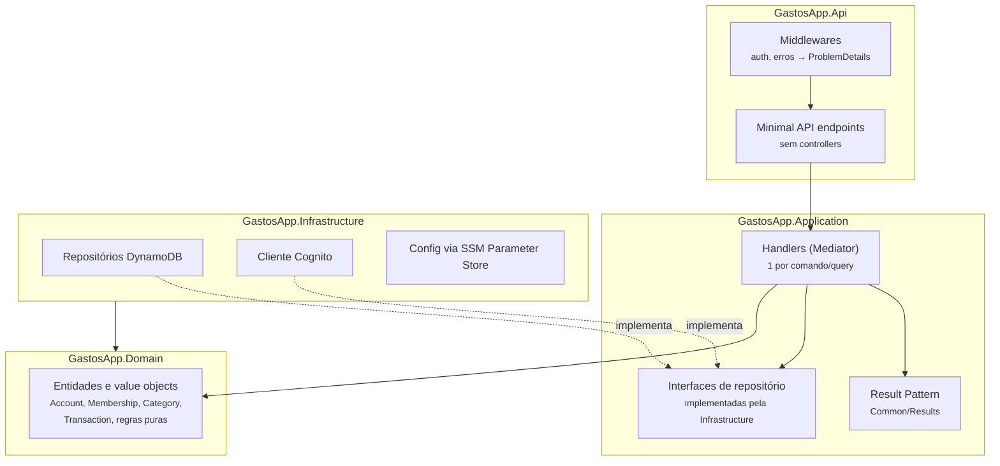
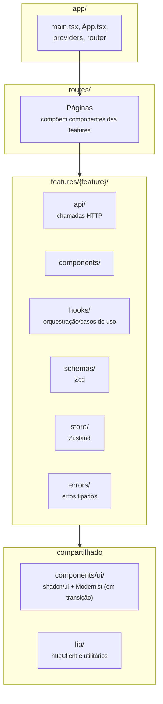
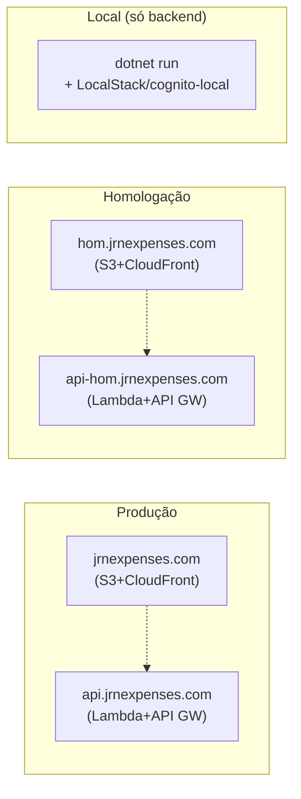

# Arquitetura — GastosApp

Visão de arquitetura do monorepo **completo** (backend + frontend),
usando o [modelo C4](https://c4model.com/) até o **nível 3** (Contexto →
Container → Componente). Nível 4 (Código) não é coberto aqui — para
isso, o próprio código-fonte é a fonte de verdade.

Este documento fica fora de `backend/` e `frontend/` porque nenhum dos
dois contextos, isoladamente, representa a arquitetura do sistema como
um todo — ver `/CLAUDE.md` na raiz sobre a separação entre contextos.

**Este documento traz só a visão estrutural (o quê existe e como se
relaciona).** Decisões de implementação, esquemas de dados, contratos
de API e passo a passo operacional vivem nos documentos específicos de
cada componente — linkados em cada seção abaixo. Não duplique esse
conteúdo aqui quando ele mudar.

## Nível 1 — Contexto do sistema

O GastosApp é um sistema de controle de gastos pessoais/familiares:
usuários se organizam em **contas** (`Account`), com um ou mais
**membros** por conta, cada um com um nível de permissão
(`Leitura`/`Lançar`/`Total`). Dentro de uma conta, os membros
cadastram **categorias** (com tipo receita/despesa e orçamento mensal
opcional) e **transações** (receitas e despesas), e consultam
**resumos mensais**, **relatórios por período** e **exportação em
CSV**.

Funcionalidades hoje implementadas (ver `backend/docs/backlog.md` para
o histórico de FEATs): autenticação e cadastro com perfil (nome,
telefone, CPF), contas multi-tenant com convites e permissões por
membro, categorias com tipo e orçamento, transações de receita/despesa,
resumo mensal (dashboard), relatórios por período e exportação CSV de
transações.

## Nível 2 — Containers

"Container" aqui é o termo do C4 (uma unidade implantável/executável
separadamente — não um container Docker). O sistema é dividido em dois
contextos independentes, cada um com sua própria infraestrutura AWS
(ver `/CLAUDE.md` raiz — "não existe infraestrutura compartilhada
entre contextos", exceto a hosted zone DNS, que o frontend gerencia e o
backend só lê).

| Container | Contexto | Descrição | Detalhes |
|---|---|---|---|
| SPA (React) | frontend | App de página única, consome a API via HTTP | `frontend/CLAUDE.md`, `frontend/docs/constitution.md` |
| S3 + CloudFront + WAF | frontend/infra | Hosting estático + CDN + TLS + regras gerenciadas | `frontend/infra/CLAUDE.md`, `frontend/infra/terraform/README.md` |
| API GastosApp (.NET/Lambda) | backend | API HTTP, Clean Architecture, Minimal APIs | `backend/CLAUDE.md` |
| API Gateway (HTTP API) | backend/infra | Roteamento + throttling na frente da Lambda | `backend/infra/CLAUDE.md` |
| Lambda PostConfirmation | backend | Cria `Account`/`Membership` no 1º login (trigger do Cognito) | `backend/docs/data-model.md`, backlog FEAT-19 |
| DynamoDB (tabela `GastosApp`) | backend | Persistência single-table de todo o domínio | `backend/docs/data-model.md` |
| Cognito User Pool | backend/infra | Autenticação (`USER_PASSWORD_AUTH`), emissão de JWT | `backend/infra/CLAUDE.md` |
| SSM Parameter Store | backend/infra | Configuração/segredos em `/GastosApp/...` | `backend/infra/CLAUDE.md` |

Cada ambiente (produção, homologação e — só no backend — local) é uma
réplica isolada desses containers (tabela, User Pool, bucket, etc.
próprios por ambiente). Ver "Ambientes" abaixo.

## Nível 3 — Componentes

### Componentes do backend (Clean Architecture)

Fluxo de dependência: `Api → Application → Domain` e
`Infrastructure → Application/Domain` (`Infrastructure` implementa
interfaces definidas em `Application`; `Domain` não depende de nada).
Convenções detalhadas (Mediator, Result Pattern, RFC 9457, sem `Scan`
no DynamoDB etc.): `backend/CLAUDE.md`.

### Componentes do frontend (feature-based / bulletproof-react)

Regra de dependência: `features/*` pode depender de `lib/`/`components/`;
o inverso nunca acontece; uma feature nunca importa de dentro de outra.
Detalhes completos (stack, design system Modernist em migração,
convenções de erro/HTTP): `frontend/CLAUDE.md`,
`frontend/docs/constitution.md`.

## Modelo de dados

Modelagem completa da tabela única do DynamoDB (item types, PK/SK,
GSIs, access patterns) vive em **`backend/docs/data-model.md`** — não
duplicado aqui.

## Ambientes e implantação

Cada contexto tem sua própria infraestrutura AWS, com produção e
homologação totalmente isolados (tabela/User Pool/bucket/distribuição
próprios por ambiente); o backend também roda 100% local via Docker
(LocalStack + cognito-local), sem depender de credenciais AWS reais.

Deploy é automatizado via GitHub Actions em ambos os contextos (branch
feature → PR automático → merge manual → deploy contínuo em
homologação a cada push em `develop` → GitHub Release dispara deploy
de produção → PR automático `develop → main`) — ver o fluxo completo em
`/CLAUDE.md` raiz ("Fluxo de Git"). Detalhes de cada pipeline,
provisionamento Terraform e gaps conhecidos (ex.: OIDC Provider/Role
criados manualmente no console):

- Backend: `backend/infra/CLAUDE.md`, `backend/infra/README.md`,
  `backend/infra/terraform/README.md`
- Frontend: `frontend/infra/CLAUDE.md`,
  `frontend/infra/terraform/README.md`

## Referências

| Assunto | Documento |
|---|---|
| Regras imutáveis do backend | `backend/docs/constitution.md` |
| Regras imutáveis do frontend | `frontend/docs/constitution.md` |
| Modelo de dados (DynamoDB) | `backend/docs/data-model.md` |
| Contrato de API (OpenAPI) | `backend/docs/openapi.json` |
| Processo SDD do backend | `backend/docs/README.md` |
| Backlog de features do backend | `backend/docs/backlog.md` |
| Infra do backend | `backend/infra/CLAUDE.md` |
| Infra do frontend | `frontend/infra/CLAUDE.md` |
| Design system (Modernist) | `frontend/design-system/README.md` |
| Modo Leve vs Fluxo Completo, fluxo de Git | `/CLAUDE.md` (raiz) |
